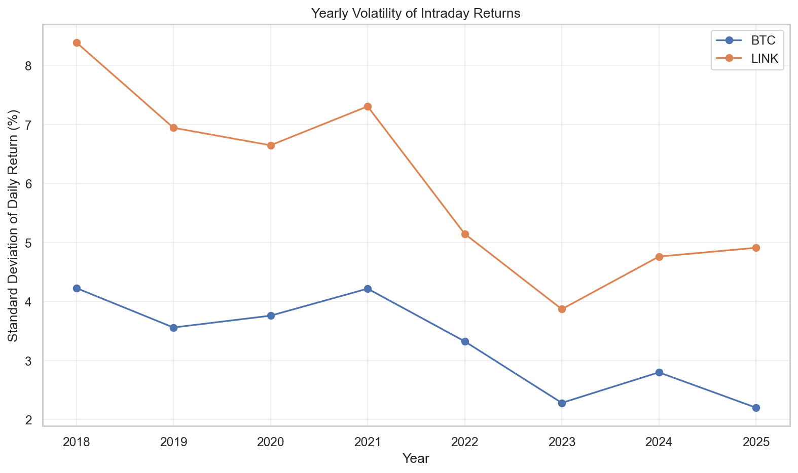
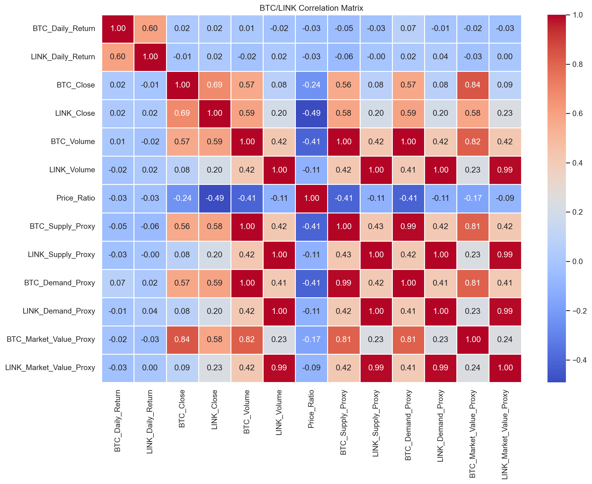
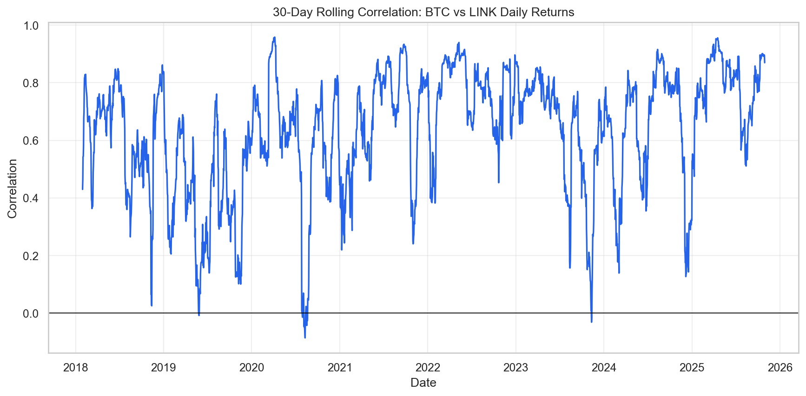
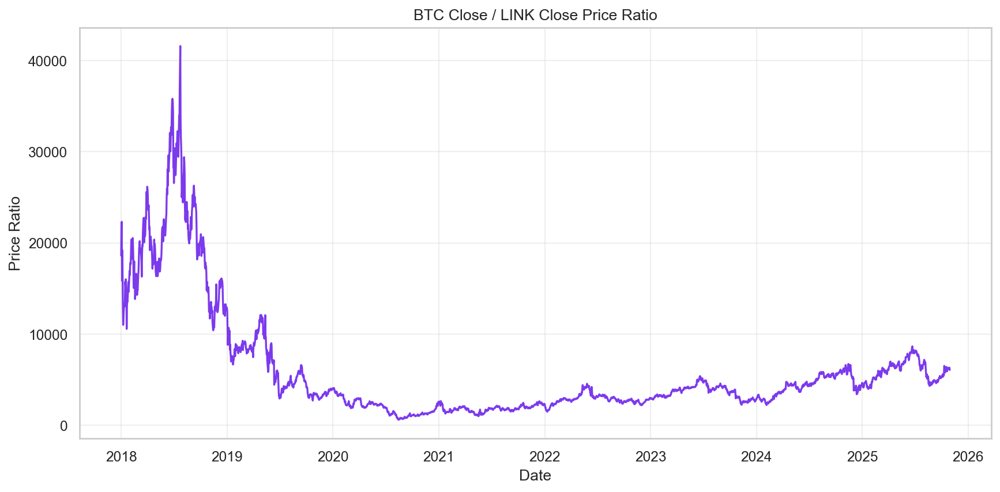
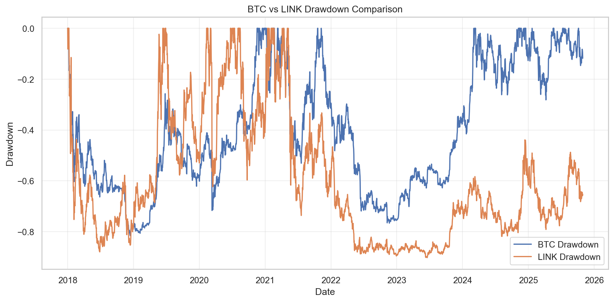
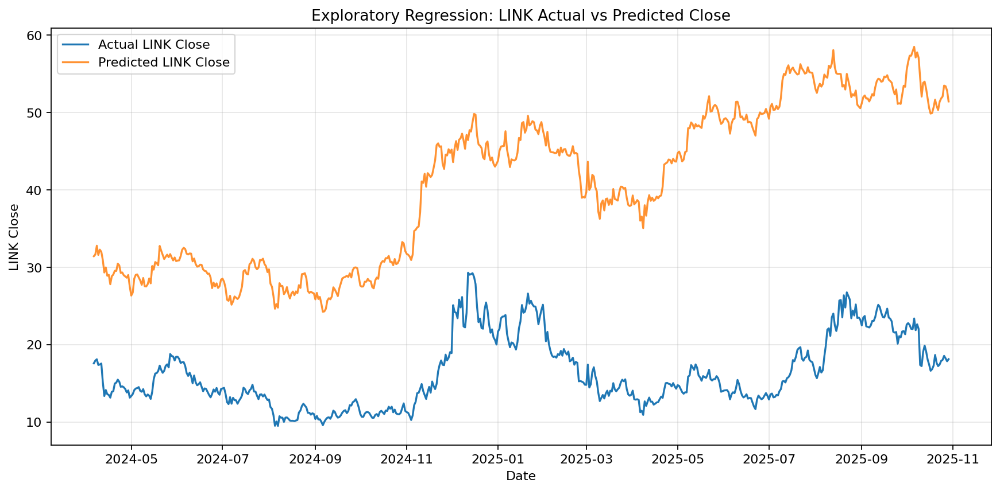

# LINK VS BTC

## Portfolio Summary

LINK VS BTC is a local Python + Power BI financial data analysis project comparing the historical behavior of Bitcoin (`BTC-USD`) and Chainlink (`LINK-USD`).

The project downloads market data from Yahoo Finance, builds a reproducible processed dataset, calculates exploratory financial/time-series metrics, saves chart and table outputs, and supports a Power BI dashboard for visual presentation.

This project is designed for portfolio, academic, and exploratory analytics use. It is not a trading application.

## Project Overview

The project compares BTC and LINK historical market behavior across:

- Price movement
- Volume behavior
- Intraday return behavior
- Volatility
- Correlation
- Rolling correlation
- BTC/LINK price ratio
- Moving averages
- Drawdown
- Exploratory linear regression relationships
- Power BI dashboard visuals

The original project used Excel formulas for several derived columns. The improved version moves those calculations into Python so the pipeline can be rerun from a fresh clone.

## Business / Analytical Objective

How can historical BTC and LINK market data be analyzed to compare price movement, volatility, correlation, volume behavior, price ratio, and exploratory relationships between the two assets?

## Important Disclaimer

This project is for educational and exploratory analysis only. It is not financial advice, trading advice, or an investment recommendation.

The regression model is an exploratory modeling experiment. It is not intended for trading, forecasting, portfolio allocation, or financial decision-making.

## Dataset

### Data Source

- Source: Yahoo Finance through the `yfinance` Python library
- Assets:
  - Bitcoin: `BTC-USD`
  - Chainlink: `LINK-USD`
- Configured date range:
  - Start: `2018-01-01`
  - End: `2025-10-30`
- Generated processed date range:
  - `2018-01-01` to `2025-10-29`

Yahoo Finance end dates are typically exclusive, so the final generated row ends on `2025-10-29`.

### Final Processed Files

- `data/processed/Link_Bitcoin.xlsx`
- `data/processed/link_bitcoin_processed.csv`

### Original Workbook Backup

The original Excel workbook was preserved before regeneration:

- `data/processed/Link_Bitcoin_original_backup.xlsx`

## Tools and Technologies

- Python
- pandas
- numpy
- yfinance
- scikit-learn
- openpyxl
- matplotlib
- seaborn
- Microsoft Excel
- Microsoft Power BI Desktop

## Project Structure

```text
link-vs-btc-analysis/
|-- data/
|   |-- raw/
|   |   |-- btc_raw.csv
|   |   `-- link_raw.csv
|   `-- processed/
|       |-- Link_Bitcoin.xlsx
|       |-- Link_Bitcoin_original_backup.xlsx
|       `-- link_bitcoin_processed.csv
|
|-- src/
|   |-- config.py
|   |-- data_preprocessing.py
|   |-- analysis.py
|   `-- modeling.py
|
|-- outputs/
|   |-- charts/
|   |-- tables/
|   `-- screenshots/
|
|-- dashboard/
|   |-- Dashboard Jaber Mahmoud 235479.pbix
|   `-- powerbi_refresh_guide.md
|
|-- README.md
|-- requirements.txt
`-- .gitignore
```

## Data Pipeline

The reproducible pipeline is:

1. Download BTC and LINK market data from Yahoo Finance.
2. Clean missing rows.
3. Rename market columns with clear `BTC_` and `LINK_` prefixes.
4. Merge BTC and LINK by `Date`.
5. Calculate returns and proxy metrics in Python.
6. Normalize selected OHLCV columns with Min-Max scaling.
7. Export processed Excel and CSV files.
8. Run exploratory analysis and modeling scripts.
9. Save output charts and tables.
10. Refresh or inspect the Power BI dashboard manually.

## Metrics Created

### Core Market Fields

For each asset:

- Open
- High
- Low
- Close
- Volume

Example columns:

- `BTC_Open`
- `BTC_Close`
- `LINK_Open`
- `LINK_Close`

### Price Change

```text
Price_Change = Close - Open
```

Columns:

- `BTC_Price_Change`
- `LINK_Price_Change`

### Daily / Intraday Return

The daily return columns use a consistent open-to-close percentage change formula:

```text
Daily_Return = ((Close - Open) / Open) * 100
```

Columns:

- `BTC_Daily_Return`
- `LINK_Daily_Return`
- `BTC_Intraday_Return_Pct`
- `LINK_Intraday_Return_Pct`

The `Intraday_Return_Pct` columns are clearer duplicates of the daily return fields.

### Price Ratio

```text
Price_Ratio = BTC_Close / LINK_Close
```

Column:

- `Price_Ratio`

### Proxy Metrics

The original workbook had columns named supply, demand, inflation, and market cap. These values are calculated only from OHLCV data, so the improved project labels them as proxy metrics.

These are not official blockchain supply, economic demand, inflation, or market capitalization values.

Proxy columns:

- `BTC_Supply_Proxy`
- `BTC_Demand_Proxy`
- `BTC_Market_Value_Proxy`
- `LINK_Supply_Proxy`
- `LINK_Demand_Proxy`
- `LINK_Market_Value_Proxy`

Backward-compatible legacy columns are retained for Power BI:

- `BTC_Supply`
- `BTC_Demand`
- `BTC_Inflation`
- `BTC_MarketCap`
- `LINK_Supply`
- `LINK_Demand`
- `LINK_Inflation`
- `LINK_MarketCap`

Important clarification:

- `BTC_Inflation` and `LINK_Inflation` are retained only for dashboard compatibility.
- In the improved pipeline, they equal the open-to-close intraday return percentage.
- They should not be interpreted as economic inflation.

### Normalized Columns

Min-Max normalized columns are created for:

- BTC open, high, low, close, and volume
- LINK open, high, low, close, and volume

Example columns:

- `BTC_Close_Norm`
- `BTC_Volume_Norm`
- `LINK_Close_Norm`
- `LINK_Volume_Norm`

## Analysis Features

### Volatility Analysis

The project calculates:

- BTC yearly volatility
- LINK yearly volatility
- Which asset was more volatile each year
- BTC overall volatility
- LINK overall volatility

Outputs:

- `outputs/tables/yearly_volatility.csv`
- `outputs/tables/overall_volatility.csv`
- `outputs/charts/yearly_volatility.png`

### Correlation Analysis

The project calculates a correlation matrix across returns, close prices, volumes, price ratio, and proxy metrics.

Outputs:

- `outputs/tables/correlation_matrix.csv`
- `outputs/charts/correlation_heatmap.png`

### Rolling Correlation

The project calculates 30-day rolling correlation between:

- `BTC_Daily_Return`
- `LINK_Daily_Return`

Outputs:

- `outputs/tables/rolling_correlation.csv`
- `outputs/charts/rolling_30_day_correlation.png`

### Price Ratio Analysis

The project analyzes:

- BTC close divided by LINK close
- Average ratio by year
- Highest ratio date
- Lowest ratio date

Outputs:

- `outputs/tables/yearly_price_ratio.csv`
- `outputs/tables/price_ratio_extremes.csv`
- `outputs/charts/price_ratio_trend.png`

### Moving Averages

The project calculates:

- BTC 30-day moving average
- BTC 90-day moving average
- LINK 30-day moving average
- LINK 90-day moving average

Outputs:

- `outputs/tables/moving_averages.csv`
- `outputs/charts/moving_averages.png`

### Drawdown Analysis

The project calculates:

- Cumulative return
- Drawdown
- Maximum drawdown date and value for each asset

Outputs:

- `outputs/tables/drawdown_timeseries.csv`
- `outputs/tables/max_drawdown.csv`
- `outputs/charts/drawdown_comparison.png`

### Exploratory Linear Regression

The project trains a simple linear regression model as an exploratory relationship test.

Outputs:

- `outputs/tables/regression_metrics.csv`
- `outputs/tables/regression_coefficients.csv`
- `outputs/tables/regression_predictions.csv`
- `outputs/charts/link_actual_vs_predicted.png`
- `outputs/charts/regression_residuals.png`

### Power BI Dashboard

The existing `.pbix` file is preserved and moved into:

- `dashboard/Dashboard Jaber Mahmoud 235479.pbix`

Refresh instructions are documented in:

- `dashboard/powerbi_refresh_guide.md`

## Modeling Section

### Model Type

Simple linear regression using `sklearn.linear_model.LinearRegression`.

### Target

- `LINK_Close`

### Features

- `BTC_Close`
- `LINK_Supply_Proxy`
- `LINK_Demand_Proxy`

### Validation

The model uses a time-ordered train/test split:

- Training rows: `2287`
- Testing rows: `572`
- Shuffle: `False`

### Generated Metrics

From the latest generated `outputs/tables/regression_metrics.csv`:

| Metric | Value |
|---|---:|
| R2 | -31.3039 |
| MAE | 24.2546 |
| RMSE | 25.4842 |

The negative R2 indicates weak out-of-sample performance on the generated test period. This supports treating the model as exploratory only.

### Limitations

A simple linear regression model was used as an exploratory modeling experiment to study relationships in the dataset. It is not intended for trading or financial decision-making.

The model does not account for:

- Time-series stationarity
- Autocorrelation
- Market regime changes
- External macroeconomic data
- Liquidity conditions
- On-chain supply data
- Nonlinear relationships
- Proper forecasting validation beyond a simple time-ordered split

## Outputs

### Data Outputs

- `data/raw/btc_raw.csv`
- `data/raw/link_raw.csv`
- `data/processed/Link_Bitcoin.xlsx`
- `data/processed/link_bitcoin_processed.csv`

### Chart Outputs

- `outputs/charts/yearly_volatility.png`
- `outputs/charts/correlation_heatmap.png`
- `outputs/charts/rolling_30_day_correlation.png`
- `outputs/charts/price_ratio_trend.png`
- `outputs/charts/moving_averages.png`
- `outputs/charts/drawdown_comparison.png`
- `outputs/charts/link_actual_vs_predicted.png`
- `outputs/charts/regression_residuals.png`

### Table Outputs

- `outputs/tables/yearly_volatility.csv`
- `outputs/tables/overall_volatility.csv`
- `outputs/tables/correlation_matrix.csv`
- `outputs/tables/rolling_correlation.csv`
- `outputs/tables/yearly_price_ratio.csv`
- `outputs/tables/price_ratio_extremes.csv`
- `outputs/tables/moving_averages.csv`
- `outputs/tables/drawdown_timeseries.csv`
- `outputs/tables/max_drawdown.csv`
- `outputs/tables/regression_metrics.csv`
- `outputs/tables/regression_coefficients.csv`
- `outputs/tables/regression_predictions.csv`

## Selected Charts

### Yearly Volatility



### Correlation Heatmap



### Rolling 30-Day Correlation



### Price Ratio Trend



### Drawdown Comparison



### LINK Actual vs Predicted



## Power BI Dashboard

The Power BI report is stored at:

```text
dashboard/Dashboard Jaber Mahmoud 235479.pbix
```

The report was not programmatically modified. It should be opened and refreshed manually in Power BI Desktop.

Refresh guide:

```text
dashboard/powerbi_refresh_guide.md
```

The original dashboard pages include:

- Close
- Volume
- Supply
- Demand
- Inflation
- Market
- Ratio

Recommended improved Power BI page structure:

1. Executive Summary
2. Price Trend Comparison
3. Volume Comparison
4. Volatility Analysis
5. Correlation Analysis
6. Price Ratio Analysis
7. Regression Results

## How to Run the Project

### 1. Create a Virtual Environment

Windows:

```powershell
python -m venv .venv
.venv\Scripts\activate
```

PowerShell alternative:

```powershell
.\.venv\Scripts\Activate.ps1
```

Mac/Linux:

```bash
python -m venv .venv
source .venv/bin/activate
```

### 2. Install Dependencies

```bash
pip install -r requirements.txt
```

### 3. Run Data Preprocessing

```bash
python src/data_preprocessing.py
```

This creates:

- `data/raw/btc_raw.csv`
- `data/raw/link_raw.csv`
- `data/processed/Link_Bitcoin.xlsx`
- `data/processed/link_bitcoin_processed.csv`

### 4. Run Analysis

```bash
python src/analysis.py
```

This creates chart and table outputs in:

- `outputs/charts/`
- `outputs/tables/`

### 5. Run Modeling

```bash
python src/modeling.py
```

This creates exploratory regression outputs in:

- `outputs/tables/regression_metrics.csv`
- `outputs/tables/regression_coefficients.csv`
- `outputs/tables/regression_predictions.csv`
- `outputs/charts/link_actual_vs_predicted.png`
- `outputs/charts/regression_residuals.png`

### 6. Refresh Power BI

Open:

```text
dashboard/Dashboard Jaber Mahmoud 235479.pbix
```

Then follow:

```text
dashboard/powerbi_refresh_guide.md
```

## Key Insights

The following values are generated from the current pipeline outputs. They may change if Yahoo Finance revises historical data or if the date range changes.

- LINK had higher yearly return volatility than BTC in every generated year from 2018 through 2025.
- Overall volatility based on open-to-close daily return:
  - BTC: `3.4064`
  - LINK: `6.1940`
- Maximum drawdown in the generated dataset:
  - BTC: `-81.53%` on `2018-12-15`
  - LINK: `-90.19%` on `2023-06-19`
- BTC/LINK price ratio extremes in the generated dataset:
  - Highest: `41575.8736` on `2018-07-24`
  - Lowest: `621.2814` on `2020-08-15`
- The exploratory regression produced a negative test R2, so it should not be interpreted as a reliable predictive model.

## Limitations

- Uses historical Yahoo Finance data only.
- `yfinance` data availability and historical values may change.
- Proxy metrics are not official blockchain, economic, or market capitalization metrics.
- The retained `Inflation` columns are backward-compatible labels and should not be interpreted as economic inflation.
- Linear regression is exploratory only.
- No trading strategy is implemented.
- No investment recommendation is made.
- Power BI refresh may require local path adjustment.
- No automated unit tests are currently included.
- The project does not include real on-chain supply data.

## Future Improvements

- Add real blockchain supply data from reliable APIs.
- Add more assets for comparison.
- Add advanced time-series modeling.
- Add model diagnostics for stationarity, autocorrelation, and residual behavior.
- Add a Streamlit dashboard.
- Add an automated Power BI refresh workflow.
- Add unit tests.
- Add a notebook walkthrough.
- Add GitHub Actions validation.
- Add source-level data dictionary documentation.

## Author

Jaber Mahmoud

